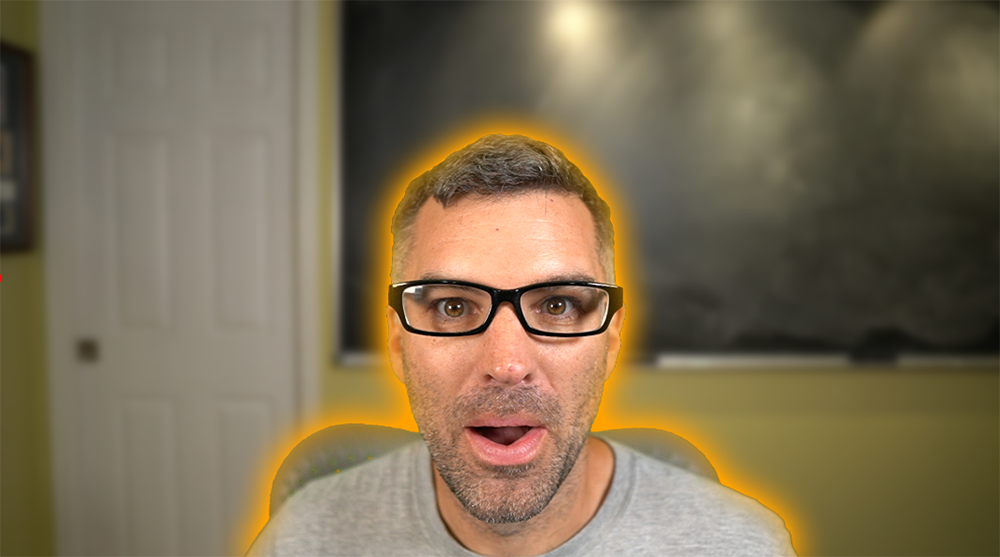
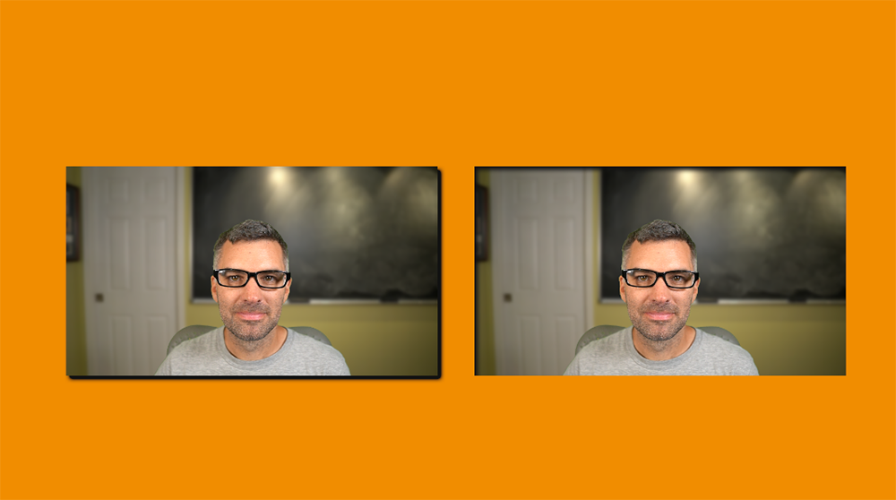

<h1 align="center">Stroke, Glow, Shadow Plugin</h1>

    <i align="center">An OBS plugin to create strokes, glow, and shadows around masked sources.</i>

<h4 align="center">
    
    
    
    
     
    
    
</h4>

> **Warning**
> It was brought to my attention that on a small number of Windows 11 machines, Windows Defender is flagging the Windows-Installer from releases 0.2.0 and 0.3.0 as malicious. After doing some analysis, it appears that this is due to our use of the Inno Setup installer, and the fact that we were not signing the code/installer. To fix this, I have gone through the process of obtaining a code signing certificate and will be able to sign releases after 0.3.0, which should get rid of the false-positive alert. In the meantime, I have taken down the windows-installers.  If you would like to install v0.2.0 or v0.3.0 on Windows you can manually install with the zip file (and the zip file and its contents are NOT flagged).

> **Note**
> While we only release new versions of the Stroke, Glow, Shadow plugin after testing it on local hardware, there are bugs and issues that will slip through. If you happen to run into any issues, please [open an issue](https://github.com/finitesingularity/obs-stroke-glow-shadow/issues) and we will work to resolve it.

## Introduction

The Stroke, Glow, Shadow Plugin offers an efficient way to apply Stroke, Glow, and Shadow effects to masked sources in OBS.

- 🚀 Stroke, Glow, Shadow, as the name implies, provides effects for applying [Stroke](#stroke), [Glow](#glow), and [Drop Shadow](#shadow) to any masked sources in OBS. You can use these effects on everything from a chroma-keyed facecam to a native OBS text source.
- ↔️ All three effects allow for inner and outer applications.
- 🎨 Additionally, all three effects offer options for solid color or another OBS source to be used for the [fill type](#fill-types).
- 🎛️ Lastly, all three effects are available as both [inline filters and as separate sources](#source-vs-filter).

## Effect Types

### Stroke
The stroke effect draws a line with user-definable stroke size and offset around the masked source.

*Stroke filter with offset applied to a chroma-keyed facecam giving the look of a sticker.*

#### Stroke Filter Parameters

1. **Source**- *Only available when used as a source* Select the source used to generate the stroke.  In the case of a filter, this is the filtered source and this input will not be shown. If using the Stroke Source a source in this dropdown must be selected.
2. **Position**- Select either Outer Stroke or Inner Stroke. Outer strokes are drawn from the edge of the mask outward, while inner strokes are drawn from the edge of the mask inward, over the top of the original source.
3. **Options**- For an Outer Stroke if using the Stroke Source there is an option for `Infill Zero Offset` which will fill inside of the stroke if the offset is zero.  For an inner stroke, both the filter and source have the option `Ignore Source Border` which will suppress drawing a stroke anywhere the masked content meets the edge of the source (e.g.- if your masked facecam is aligned with the bottom of the source).
4. **Stroke Size**- Specifies the thickness (in pixels) of the stroke.
5. **Offset**- Indicates how many pixels from the edge of the mask you want the stroke to be drawn.
6. **Offset Quality**- If you are providing an offset value, you can choose the offset calculation algorithm. *Fast* is a quick approximation and will result in less accurate (but still visually pleasing) stroke thickness. *More Accurate* uses a two-pass technique (resulting in double the number of texture samples) to provide a more accurate stroke thickess.
7. **Anti-Alias**- If selected will perform a basic anti-aliasing pass to remove the jagged edges seen on the edges of the stroke.
8. **Fill Type**- Choose between Color or Source.
9.  The color or source to be used as fill.

### Glow

The glow effect draws a feathered stroke with a user-defined size and intensity around the masked source.

*Chroma-keyed facecam with both an inner and outer glow applied.*

1. **Source**- *Only available when used as a source* Select the source used to generate the glow.  In the case of a filter, this is the filtered source and this input will not be shown. If using the Glow Source a source in this dropdown must be selected.
2. **Position**- Select either Outer Glow or Inner Glow. Outer glows are drawn from the edge of the mask outward, while inner glows are drawn from the edge of the mask inward, over the top of the original source.
3. **Options**- For an Outer Glow, if using the Glow Source, there is an option for Infill which will fill inside of the glow (the area that would be behind the original source). For an inner glow, both the filter and source have the option to Ignore Source Border, which will suppress drawing a glow anywhere the masked content meets the edge of the source (e.g., if your masked facecam is aligned with the bottom of the source).
4. **Size**- Specifies the thickness (in pixels) of the glow.
5. **Intensity**- Determines how bright the glow is.  Higher intesity values will have less feathering and brighter colors.
6. **Fill Type**- Choose between Color or Source.
7. The color or source to be used as fill.

### Shadow

The shadow effect draws an offset drop-shadow simulating a light causing the selected source to cast a shadow, giving the effect of the source floating off the canvas.

*Webcam with outer (left) and inner (right) shadows applied.*

1. **Source**- *Only available when used as a source* Select the source used to generate the shadow.  In the case of a filter, this is the filtered source and this input will not be shown. If using the Shadow Source a source in this dropdown must be selected.
2. **Position**- Select either Outer or Inner Shadow. Outer shadows give the sense of the source floating over the top of the canvas, while inner shadows make the source appear as if it is in a cutout below the canvas.
3. **Options**- For an Outer Shadow, if using the Shadow Source effect, there is an option for Infill which will fill inside of the shadow (the area that would be behind the original source). For an inner shadow, both the filter and source have the option to Ignore Source Border, which will suppress drawing a shadow anywhere the masked content meets the edge of the source (e.g., if your masked facecam is aligned with the bottom of the source).
4. **Size**- Specifies the thickness (in pixels) of the feathered portion of the shadow.
5. **Intensity**- Determines how strong the shadow is. Higher intensity values will have less feathering and more saturated colors (e.g., darker grays).
6. **Light Angle**- Specifies the direction the shadow is cast.
7. **Shadow Distance**- Indicates the distance in pixels that the shadow is cast.
8. **Fill Type**- Select Color or Source.
9.  The color or source to be used as fill.

## Fill Types
A stroke, glow, or shadow can be filled using either a solid color or a source.

1. **Color**- Represents an RGBA color. The alpha channel can be used to create a lower opacity result, allowing the background to show through.
2. **Source**- Refers to a different OBS Source. This can be anything from a media source to a fully filtered and rendered scene.

## Source vs. Filter
This plugin provides all three effects as both filters that can be applied to an existing source and as sources that can be added to your scenes. When used as a filter, the effect is drawn, with the filtered source rendering in front of (for outside effects) or behind (for inside effects) the rendered effect. When used as a source, the user selects another source whose alpha mask will be used to calculate the effect, and the effect will be drawn on its own without rendering the original source. Using a source effect has the advantage of not affecting the original masked source, and the resulting stroke, glow, or shadow can have its own filters applied to it. Additionally, the user has more control over how the effect is layered and the blending method used for compositing. Using the filter effect combines both the effect and the original source, making it easier to transform together when placed in a scene.
